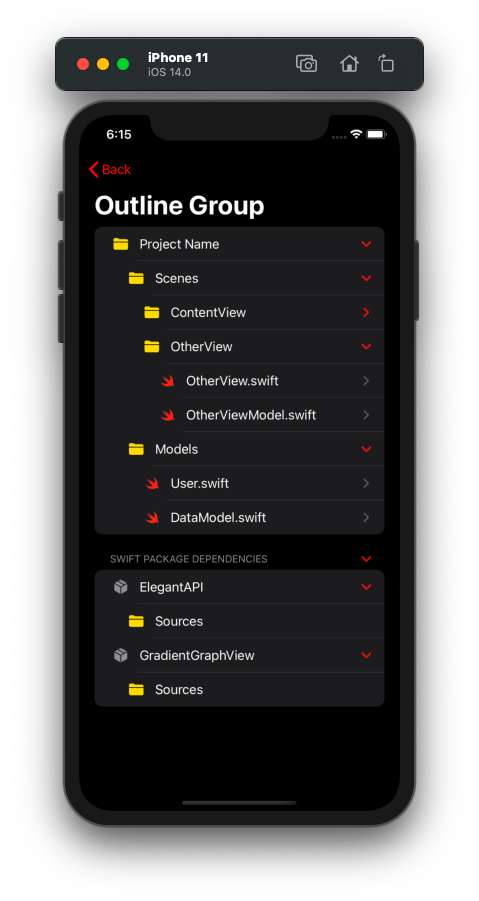
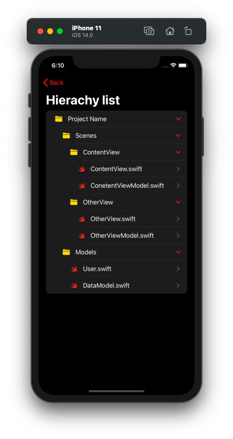
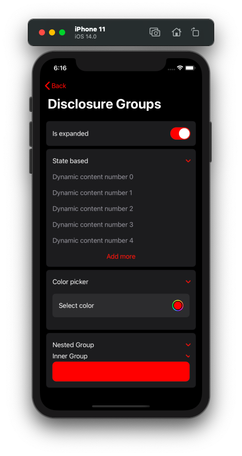
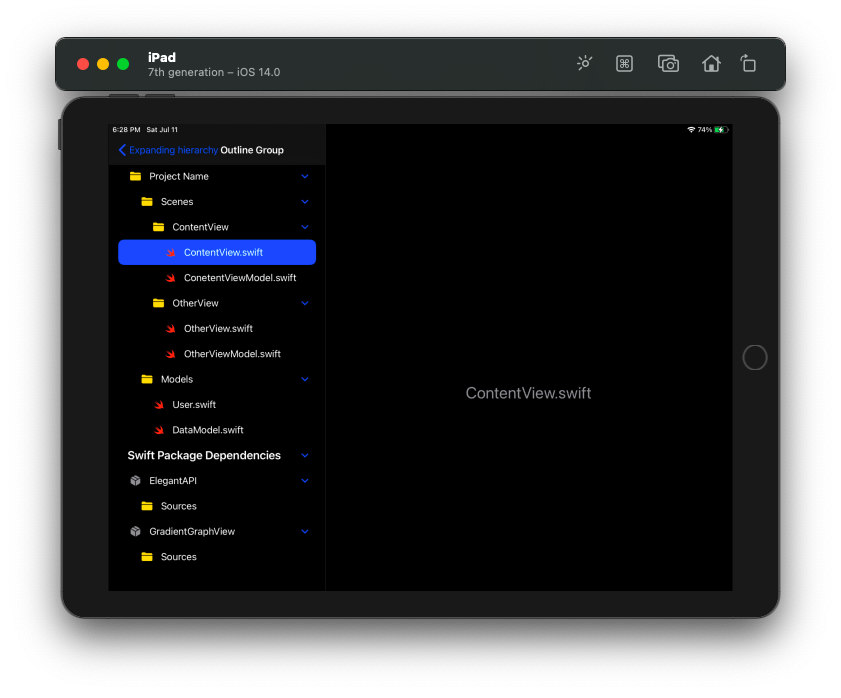
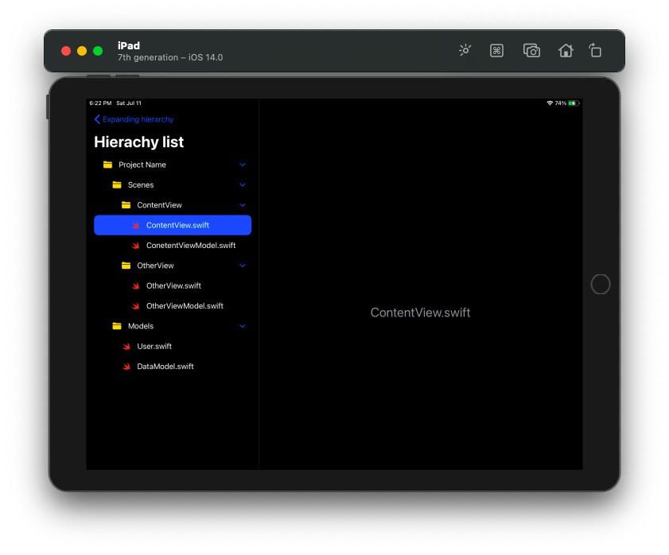
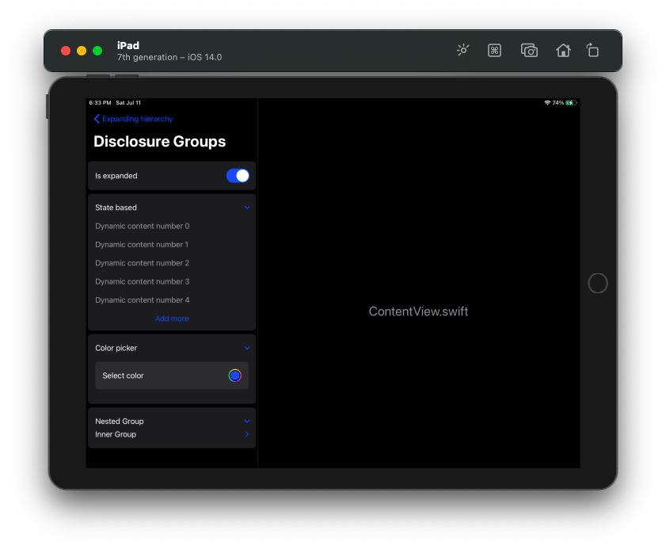
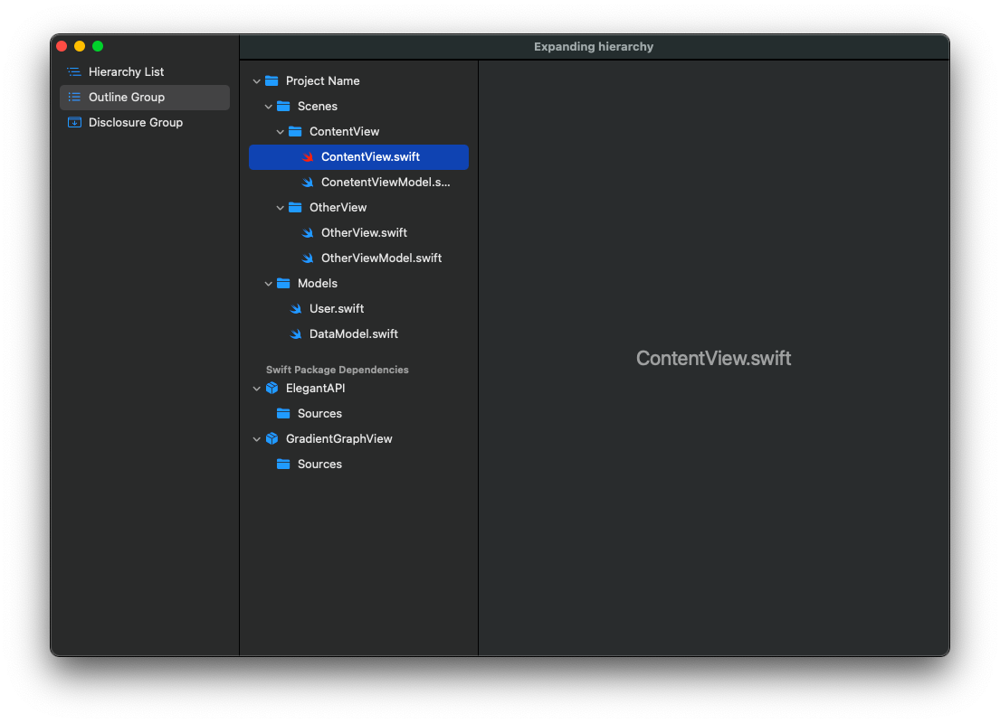
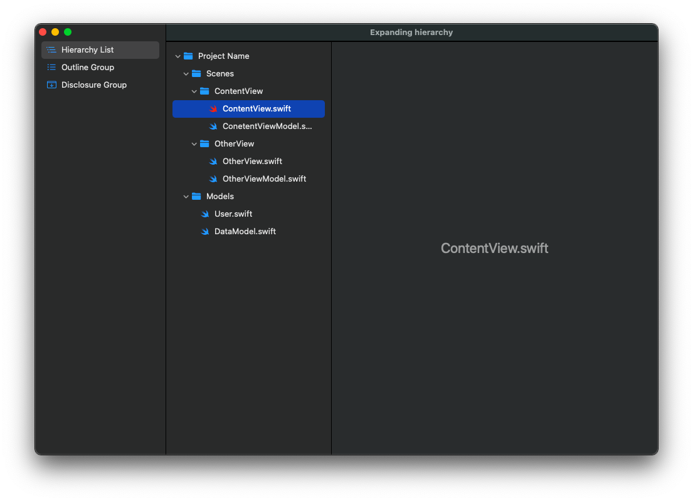
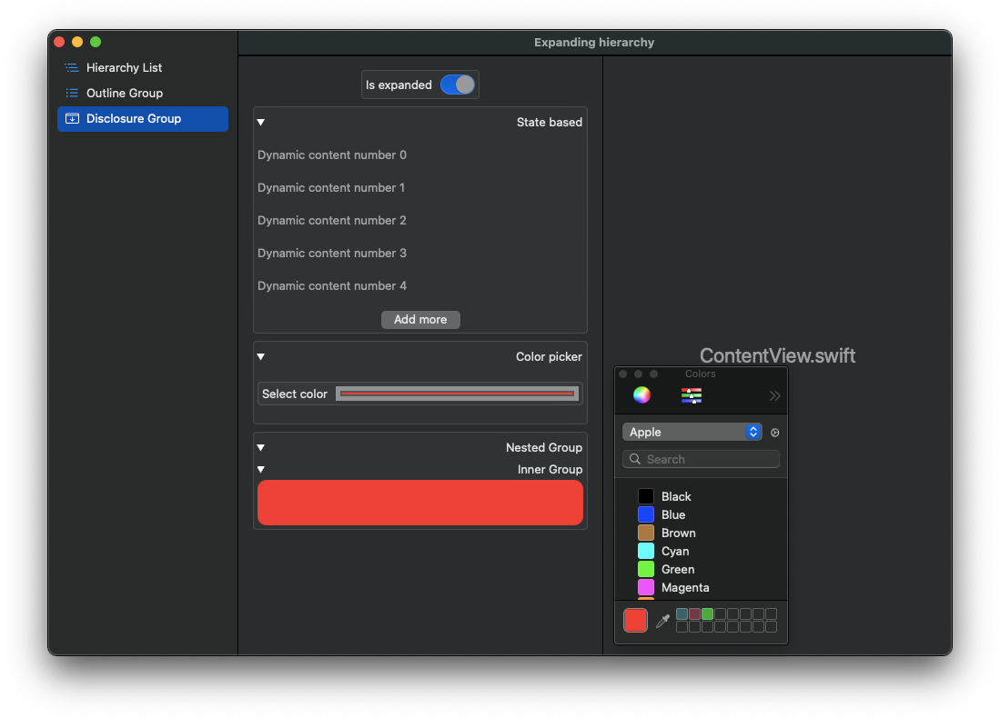

# Expanding Heirarchy

###### This is an demo project i create while trying out some new features of SwiftUI, like [Disclosure Groups](https://developer.apple.com/documentation/swiftui/disclosuregroup), [Expanding List](https://developer.apple.com/documentation/swiftui/list/init(_:children:selection:rowcontent:)-70k8w), [Outline Group](https://developer.apple.com/documentation/swiftui/outlinegroup) and [Color picker](https://developer.apple.com/documentation/swiftui/colorpicker).

> Tap on images to see coresponding code implementation

## iOS

## iPadOS

## macOS

